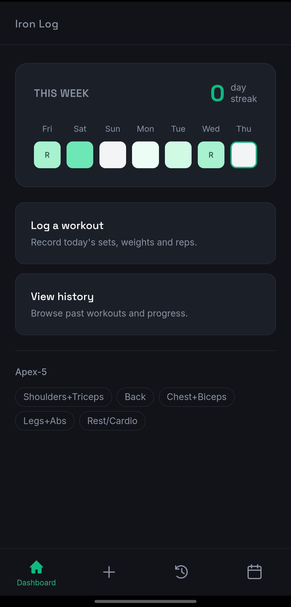
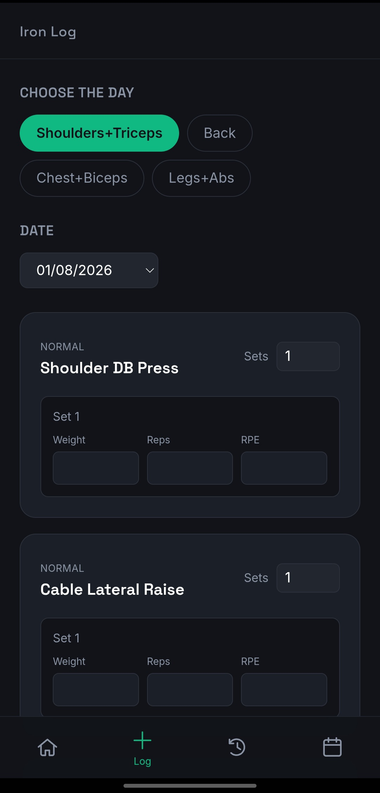
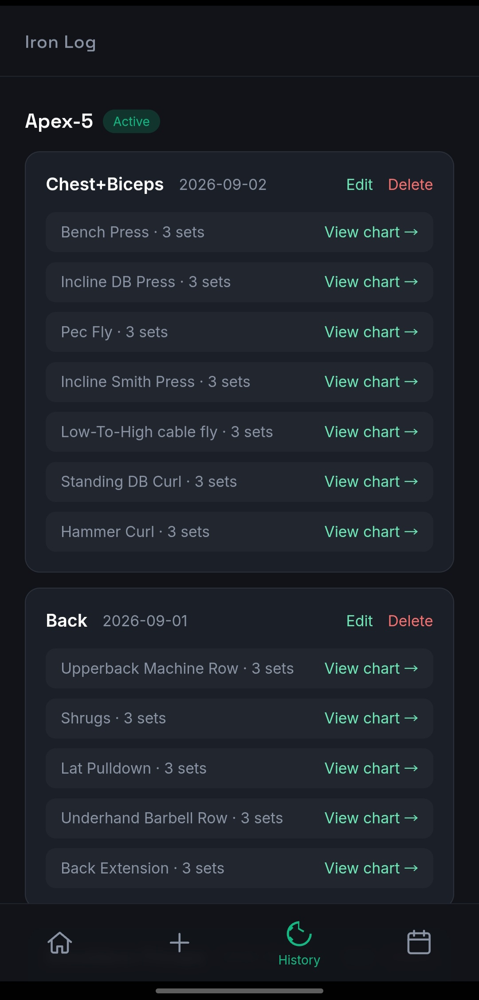
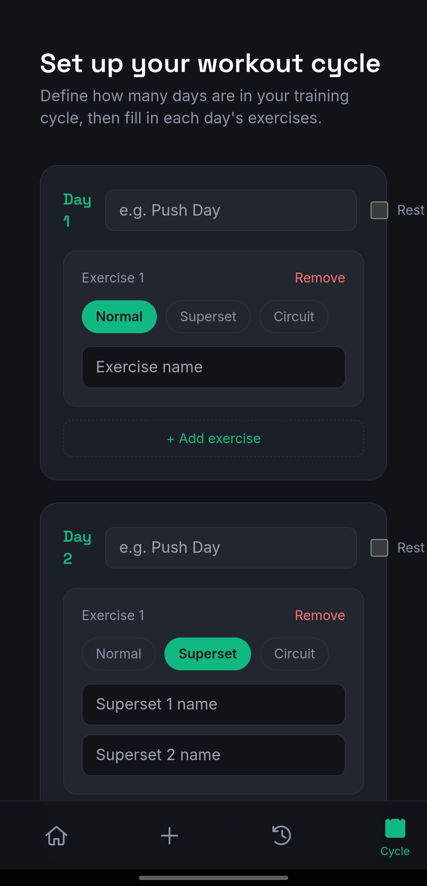
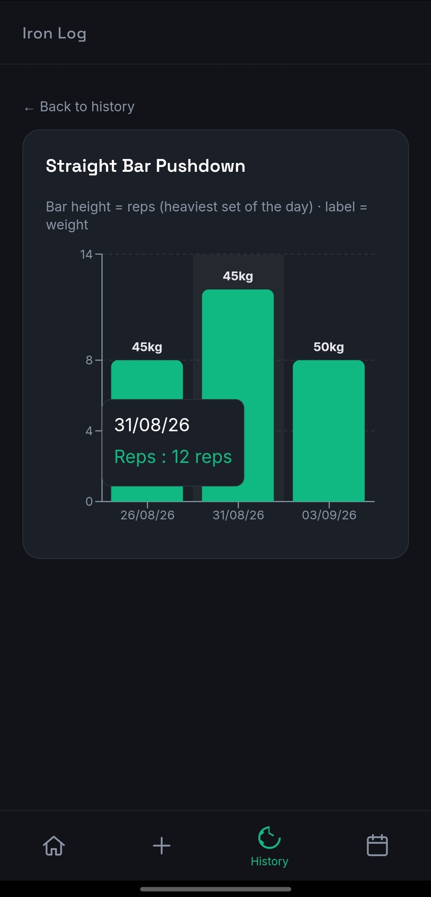
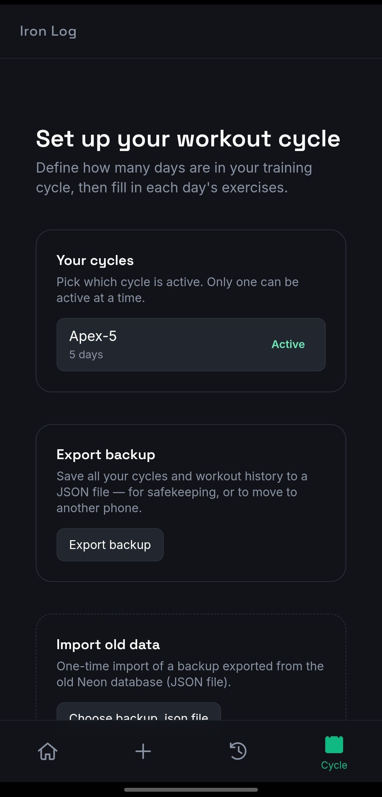
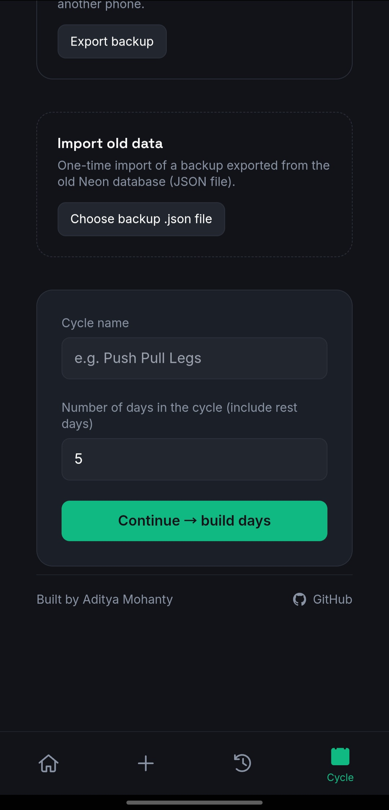

# Iron Log

**A fully offline gym tracker for Android — no backend, no internet required.**

Build your training cycle, log every set, and track your progress with streaks and per-exercise charts. Everything lives on your device.

<p align="center">
  
  
  
  
</p>

<p align="center">
  
  
  
  
</p>

---

## Why this exists

Iron Log started as a fairly standard web-app stack — Postgres on [Neon](https://neon.tech), a [FastAPI](https://fastapi.tiangolo.com) backend on [Render](https://render.com), and a [Vite](https://vitejs.dev)/React frontend on [Vercel](https://vercel.com). That's a fine stack for a lot of things, but a gym tracker needs to work in a locker room with no signal, on a flight, or wherever your gym happens to have terrible reception.

So the entire backend was removed. The Postgres schema was ported to on-device SQLite, the API layer was replaced with local queries, and the whole thing was wrapped as a native Android app with [Capacitor](https://capacitorjs.com). It now runs with zero network dependency — the same UI, entirely offline.

## Features

- **Custom cycle builder** — define any N-day training split, with rest days, and normal / superset / circuit exercise types
- **Streak tracking** — a rolling 7-day view with a color gradient that builds the more consistently you train
- **Per-exercise history charts** — see reps and weight progression over time for any exercise
- **JSON export / import** — back up your data or move it to another phone, no cloud account required
- **Fully offline** — every read and write hits an on-device SQLite database; works in airplane mode
- **No login** — single-user by design, opens straight to your dashboard

## Tech stack

| Layer | Tech |
|---|---|
| UI | React + Vite + Tailwind CSS |
| Native shell | [Capacitor](https://capacitorjs.com) (Android) |
| Data | On-device SQLite via [`@capacitor-community/sqlite`](https://github.com/capacitor-community/sqlite) |
| Charts | [Recharts](https://recharts.org) |
| Backup transport | `@capacitor/filesystem` + `@capacitor/share` |

No backend. No API. No cloud database.

## Built around progressive overload

Iron Log isn't just a logbook — it's structured around one specific training principle: **progressive overload via double progression**, which is one of the most effective, sustainable ways to drive muscle hypertrophy.

**How the method works:**

1. Pick a weight you can lift for **8 reps** on a given exercise.
2. Each time you repeat that exercise (same weight), aim for **one more rep than last time**.
3. Once you hit **12 reps** at that weight, add a small amount of weight and drop back down toward 8 reps — then repeat the climb.

This 8→12 rep "ladder" keeps you in the hypertrophy-optimal rep range while guaranteeing continuous, measurable progress — you're never guessing whether today's session was actually harder than last time.

**How the app supports this:**

- **Per-exercise history charts** plot reps over time at a glance, so you can immediately see whether you're climbing the ladder (reps trending up) or plateaued (time to check form, recovery, or nutrition)
- The weight label on each bar makes it obvious exactly when you jumped up in weight and reset the rep count
- **Streak tracking** keeps the consistency side of the equation visible — progressive overload only works if you show up on a repeatable cycle
- Because every set, rep, and weight is logged locally and instantly (no network round-trip), there's zero friction to logging mid-set between reps in the gym

If you're training for hypertrophy, the intended workflow is: build your cycle around compound + accessory lifts in the 8–12 rep range, log every set faithfully, and use the exercise chart as your primary "am I progressing" signal — not just your bodyweight or the mirror.

<p align="center">
  
  <br/>
  <sub>Straight Bar Pushdown: 8 reps → 12 reps at 45kg, right before the next weight jump</sub>
</p>

## Download

Don't want to build it yourself? Grab the latest APK from the [Releases](../../releases) page and sideload it directly — no Play Store, no account, no internet needed after install.

> **Note:** Android will warn about installing from an unknown source the first time — that's expected for a sideloaded APK. Enable "Install unknown apps" for your browser/file manager when prompted, then open the downloaded `.apk` file.

## Getting started

```bash
cd frontend
npm install
```

Run in a browser for quick UI iteration (uses an IndexedDB-backed SQLite polyfill):

```bash
npm run dev
```

Build and run on an Android device (requires the Android SDK — see [Android Studio](https://developer.android.com/studio) or the [command-line tools](https://developer.android.com/studio#command-tools)):

```bash
npx cap add android      # one-time
npm run assets:generate  # generates the app icon + splash screen
npm run android:run      # builds and installs on a connected device
```

Once installed, the app works fully offline — try it in airplane mode.

## Project structure

```
Iron-Log/
├── README.md
└── frontend/
    ├── capacitor.config.json     # native app config (icon/splash plugin settings)
    ├── package.json
    ├── vite.config.js
    ├── tailwind.config.js
    ├── index.html
    ├── assets/                   # source icon/splash images (fed into cap assets:generate)
    │   ├── icon.svg
    │   ├── icon-foreground.svg
    │   └── splash.svg
    └── src/
        ├── main.jsx               # entry point; bootstraps SQLite (native + web)
        ├── App.jsx                # shell, tab routing, bottom nav
        ├── db.js                  # local data layer — schema, CRUD, dashboard/streak
        │                          # logic, history queries, JSON export/import
        ├── icons.jsx               # hand-rolled nav icon set (outline/filled)
        ├── index.css
        └── components/
            ├── SetupCycle.jsx      # cycle builder, cycle picker, backup export/import
            ├── LogWorkout.jsx      # workout logging UI
            ├── History.jsx         # past workouts grouped by cycle
            ├── ExerciseChart.jsx   # per-exercise reps/weight chart
            └── WeekStreak.jsx      # dashboard streak + week view
```

## Data & backups

Everything — cycles, days, exercises, logged sets — lives in a single SQLite database on the device. Use **Export backup** on the Cycle Setup tab any time to save it all to a JSON file via the native share sheet (Drive, email, wherever). The same file can be re-imported later on this phone or a different one via **Import old data**.

<p align="center">
  
  
</p>

## License

MIT

---

Built by [Aditya Mohanty](https://github.com/AdityaMohanty374)